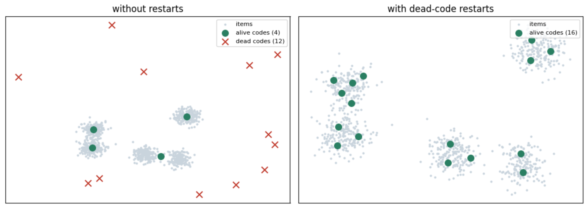
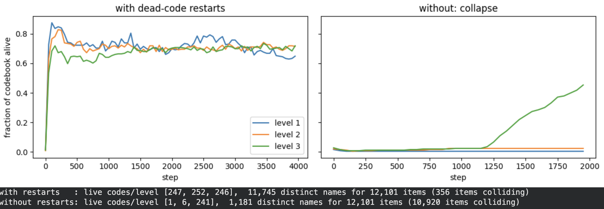

# From two tower model to Generative retrieval [2/3]

*Series: Generative Retrieval, part 2 of 3.*

Part 1 ended with a diagnosis:

> The two-tower gives every item a location in a learned space, built entirely from interactions. No interactions, no identity: a new item’s nearest neighbors are decided by the random seed.

(Missed it? Find it [here]())

This part builds the alternative. By the end, every item has a name: a tuple of discrete codes like (12, 41, 7), first code roughly the category, second the subcategory, third the item.

Learned from what the item is, not from who clicked it. In part 3 a transformer learns to predict items for users.

Three requirements to build such a model, each one shaping the design:

  1. **Unique.** Two items cannot share a name, or it is not an identifier.

  2. **Hierarchical.** Similar items must share prefixes.

  3. **Generatable.** The codes must be producible left to right by an autoregressive model. Otherwise where’s is GenAI?!

## The input: text embeddings

For each item, concatenate title, brand, category path, and a description snippet into one string, and run it through a frozen pretrained sentence encoder (all-MiniLM-L6-v2). Output: a 384-dimensional vector per item, where semantically similar texts land near each other.

The encoder was contrastively trained on about a billion sentence pairs; we train nothing here but just reuse.

No review text goes in. Reviews describe opinions, not identity, and a genuinely new item has metadata but no reviews.

One subtlety about that input string: Amazon’s metadata includes the category path (”Beauty > Hair Care > Shampoo”), so the human taxonomy is literally part of the text the encoder reads.

That is a real reason the level-1 codes later align so cleanly with categories: the taxonomy leaks into the embedding. Drop the category field and you still get a hierarchy, built from title and description semantics alone, just a fuzzier one. What goes into the text is our choice, and it shapes what the codes can encode.

So we have per-item vectors: continuous, 384 floats, unique.

We need three discrete hierarchical codes now. Let’s build them!

## Residual quantization

Quantization means replacing a vector with the nearest entry from a small learned table, the codebook. Store the entry’s index instead of the vector: one integer instead of 384 floats, at the price of error.

Residual quantization runs the trick recursively. Quantize the vector against codebook one. Subtract the chosen codeword; what remains, the residual, is everything code one missed.

Quantize the residual against codebook two. Subtract. Repeat. Code one captures the coarse shape (”this embedding is skincare-shaped”), each level refines the last. The hierarchy requirement we listed above falls out of quantizing errors of errors.

The RQ-VAE wraps this in an autoencoder. An autoencoder is two networks trained as one: an encoder compresses the input, a decoder reconstructs it, the loss is reconstruction error.

Here: encoder MLP maps 384-d to a 32-d code space, three codebooks of 256 codes quantize residuals, decoder rebuilds the 384-d embedding from the summed codewords. If three codes carry enough to rebuild the content embedding, they are a faithful compressed identity.

Level one quantizes the full embedding, so it can only capture the dominant directions of variance in that space, and in a catalog’s text-embedding space the largest thing separating items is what kind of product they are.

Level two quantizes what level one missed, the next-largest structure (sub-type, brand family).

Level three, the residual of that. The tiers are emergent: coarse-to-fine falls out of quantizing residuals. We do not assign meanings to levels; the data’s variance structure does.

Industry splits on how to fit the codebooks. TIGER trains the RQ-VAE end to end. Kuaishou’s OneRec uses RQ-KMeans, same residual structure, codebooks fit by clustering, trading fidelity for stability at their scale.

The residual principle is the invariant.

I built the RQ-VAE: canonical, and its main failure mode is the most useful thing in this article.

* * *

## Implementation: two lines carry the weight

Full model in [Part 2 of the notebook](https://colab.research.google.com/drive/17C3s-M_TVuoNoBqLi7YTA7zCMoxoAKvG#scrollTo=098e54bf). Encoder 384 to 32, three codebooks of 256, decoder back to 384. Two details matter.

**Codebooks are buffers, not parameters.** Gradients never touch them. Each code’s vector is an exponential moving average of the encoder outputs assigned to it: a code drifts toward the mean of the embeddings that use it. Far more stable than gradient-updated codebooks.

**The straight-through estimator.** Quantization is an argmin; argmin has no gradient, so nothing upstream of it would train. The fix is one line: zq_st = z + (zq - z).detach() Forward pass uses the quantized vector, backward pass pretends quantization was the identity function, so the encoder receives gradients anyway.

## Codebook collapse (failure mode!)

A code is only updated when items are assigned to it. Codes that win early assignments drift toward the data and win more. Codes that start in empty space are never chosen, never move, dead from step one. Rich-get-richer and the equilibrium is a 256-way codebook behaving like a 15-way one.

You have seen this before: it is k-means’ empty-cluster problem. A centroid initialized in empty space claims zero points forever.

What makes it dangerous: the loss hides it. The encoder trains jointly and learns to route every item through whatever codes survive, so reconstruction keeps improving the whole time.

Few live codes, few possible tuples, items pile onto shared tuples, and the dedup token ends up doing the identity work.

The “semantic” ID degrades into an arbitrary ID and you don’t spot it.

The notebook shows it twice. First in 2D, where you can see it: 1,000 points in five clusters, 16 codes, the exact EMA update rule.

Without restarts, the codes that started outside the data sit dead while a few insiders carve up everything. Then at full scale, same tokenizer trained with and without the fix:

  * with restarts: 247, 252, 246 of 256 codes alive; **11,745 distinct names** for 12,101 items; 356 collisions

  * without: level 1 collapses to **one live code** inside 200 steps; **1,181 distinct names** ; 10,920 collisions

Reconstruction loss fell in both runs. One tokenizer can tell twelve thousand items apart by semantics, the other about a thousand.

The fix: dead-code restarts. Any code whose EMA usage drops below a threshold is re-seeded at a live encoder output from the current batch.

Same move as re-seeding empty k-means centroids.

Operational lesson: monitor codebook usage, not only loss.

## From clusters to identifiers

Push all 12,101 items through the trained tokenizer: 11,745 distinct 3-code tuples, so 356 items share a tuple with at least one other. Requirement 1 forbids that.

TIGER’s answer, one sentence in the paper: a fourth token. Items sharing a tuple get dedup codes 0, 1, 2 in arbitrary order. Semantically meaningless by design; by level four the semantics are spent, it exists for uniqueness. Largest collision bucket here: 16 items.

Alongside it we build the structure part 3 depends on: a prefix trie over all valid IDs. A trie maps every prefix to the set of codes that can legally follow it: query (12, 41) and get back exactly the third codes that lead to a real item.

In part 3 it is the difference between generating recommendations and hallucinating products that do not exist.

## Is the hierarchy real

Checkable by hand, so check it.

Prefix (129,), 119 items, is shampoo: Herbal Essences, Pureology Hydrate, CLEAR Men 2-in-1, a J.R. Liggett bar shampoo, an Axe dry shampoo, Burt’s Bees Baobab.

Prefix (111,), 109 items, is sun protection: EltaMD UV Clear SPF 46, Banana Boat SPF 50 sprays, Obagi SPF 35, SkinCeuticals SPF 50.

Drill deeper: prefix (129, 73) is four specific shampoos across brands.

One code gathers a category, two codes gather near-substitutes, nothing was labeled.

The hierarchy fell out of quantizing residuals of a text embedding. It works! :D

## Next

Every item has a unique, content-derived, hierarchical, generatable name.

Part 3 builds the model that consumes them: histories become token sequences, recommendation becomes constrained next-token prediction, and the three architectures meet on the same data.

— Ludo

 _Caveats. MiniLM is the free-tier encoder choice; TIGER used Sentence-T5, and the encoder is a swappable module. The 3x256 codebook configuration follows TIGER’s Beauty setup; larger catalogs go deeper or wider, and the collision rate tells you when._

## Colab [here](https://colab.research.google.com/drive/17C3s-M_TVuoNoBqLi7YTA7zCMoxoAKvG#scrollTo=098e54bf)
