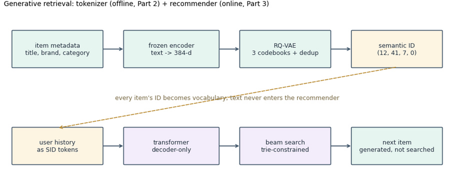

# From two tower model to Generative retrieval [3/3]

*Series: Generative Retrieval, part 3 of 3.*

> Paid post — only the publicly visible preview is included.

*Series: Generative Retrieval, part 3 of 3.*

* * *

Part 1 built the setup.

Part 2 gave every item a content-derived name.

This part builds the model the series is named after, then contrasts the three architectures on the same data.

The idea in two sentences:

> A user’s history is a sequence of semantic IDs, so it is a sequence of tokens; recommendation is next-token prediction. The retriever is a decoder-only transformer that generates the next item’s identity instead of searching an index for it.

If “next-token prediction” is new: the model reads a token sequence and outputs, at each position, a probability over the whole vocabulary for what comes next.

Training minimizes cross-entropy against the actual next token (teacher forcing: the model always sees the true history, not its own guesses). This is the GPT training recipe, applied to RecSys.

The two-tower stored 12,101 identities as embedding rows.

The generative model’s whole vocabulary is 786 tokens: three levels of 256 codes, 16 dedup codes, 2 specials. All 12,101 identities are composed from them

## The catch

A decoder samples freely from its vocabulary, so it can emit a code tuple no item owns. That’s bad :D.

The trie from part 2 resolves it. At every decoding step, the set of legal next codes is exactly the set that extends the current prefix toward a real item; everything else is masked to negative infinity before the softmax.

Beam search under this mask (beam search: keep the B highest-probability partial sequences at each step instead of just one, B = 20 here) can only terminate at real items, by construction. Cost: a dictionary lookup per step.

The standard critique that generative recommenders “hallucinate items” is a critique of unconstrained decoding. Every production deployment in this space decodes constrained.

* * *

## Model and training

All the juicy details below, including the colab with code running on free GPU:
