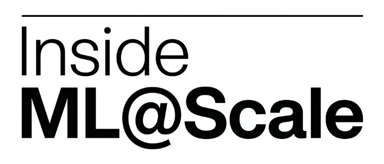
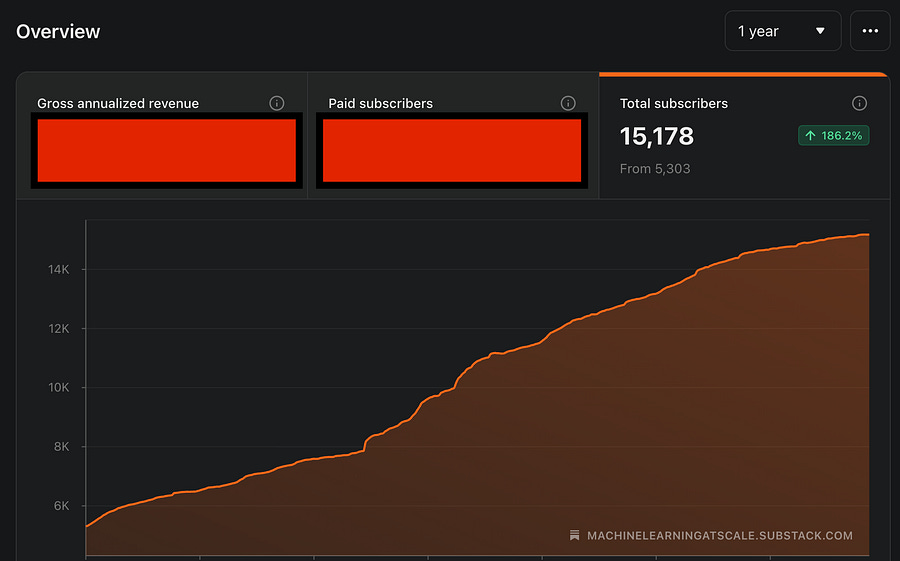

# Inside ML@Scale #5

*We keep grinding!*

> Paid post — only the publicly visible preview is included.

*We keep grinding!*

Every 25th of the month, I publish **Inside ML@Scale**. A full, honest look at the business behind this newsletter.

The good, the bad.

What’s growing, what’s stagnating, what I’m trying that isn’t working (or sometimes is working!)

### **Top-line: where we are in August 2026**

  * **15,100+** free subscribers

  * **51,000+** LinkedIn followers

  * **~25%** open rate (still constant, at this point I consider this good lol)

  * **6x/week** LinkedIn/X cadence, **3x/week** newsletter cadence

### **What worked this month**

[![ML@SCALE · 1:1 · One deleted model with one over-trusted agent \[Edition #3\]](../assets/e7e742fec1f4ef1f.jpg)ML@SCALE · 1:1 · One deleted model with one over-trusted agent [Edition #3]Ludovico Bessi·Aug 2[Read full story](2026-08-02-mlscale-11-one-deleted-model-with.md)](2026-08-02-mlscale-11-one-deleted-model-with.md)

[![From two tower model to Generative retrieval \[1/3\]](../assets/11f785e5980b4fe8.avif)From two tower model to Generative retrieval [1/3]Ludovico Bessi·Aug 9[Read full story](2026-08-09-from-two-tower-model-to-generative.md)](2026-08-09-from-two-tower-model-to-generative.md)

[I Left ML for "Impact." It's the Worst Trade I've MadeLudovico Bessi·Aug 12[Read full story](2026-08-12-i-left-ml-for-impact-its-the-worst.md)](2026-08-12-i-left-ml-for-impact-its-the-worst.md)

[![THE ZÜRICH FEED \[Edition #9\]](../assets/7be24b2bfc90693a.webp)THE ZÜRICH FEED [Edition #9]Ludovico Bessi·Aug 19[Read full story](2026-08-19-the-zurich-feed-edition-9.md)](2026-08-19-the-zurich-feed-edition-9.md)

This has been quite the slow month. August I guess!

The generative recommendation series had nice results, but then flopped a bit once it got more technical in later editions.

In September, I will be experimenting with less technical content and more career / personal content. Let’s see how that goes!

### **What did not work this month**

[66 Open Roles in Zurich For YouLudovico Bessi·Aug 5[Read full story](2026-08-05-the-zurich-feed-edition-8.md)](2026-08-05-the-zurich-feed-edition-8.md)

[![From two tower model to Generative retrieval \[3/3\]](../assets/6421d943fe72513f.avif)From two tower model to Generative retrieval [3/3]Ludovico Bessi·Aug 23[Read full story](2026-08-23-from-two-tower-model-to-generative-52a.md)](2026-08-23-from-two-tower-model-to-generative-52a.md)

[![From two tower model to Generative retrieval \[2/3\]](../assets/42d1cac150a3ebe0.avif)From two tower model to Generative retrieval [2/3]Ludovico Bessi·Aug 16[Read full story](2026-08-16-from-two-tower-model-to-generative-750.md)](2026-08-16-from-two-tower-model-to-generative-750.md)

Free to paid conversion remains weak.

# **The business numbers**

All right. Let’s get into the details.

But first. Let’s remember something. The GRIND is real.

Clear by looking at 1 year numbers:

Ok. Having zoomed out a bit, let’s get the juicy details:
