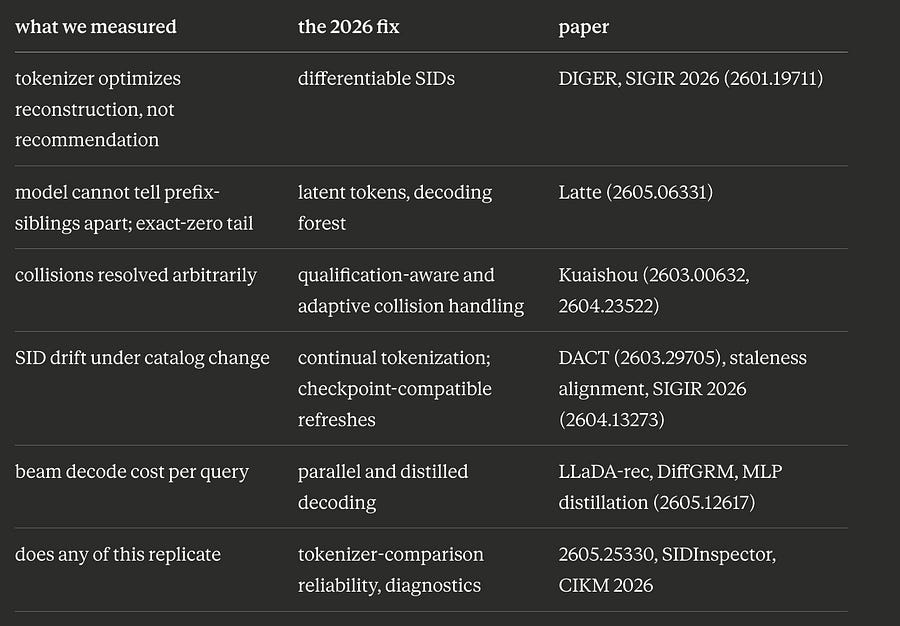

# Generative RecSys in 2026 - the papers

*Series: Generative Retrieval, follow-up edition*

> Paid post — only the publicly visible preview is included.

*Series: Generative Retrieval, follow-up edition*

The s[eries ended with a list of measured problems](2026-08-23-from-two-tower-model-to-generative-52a.md).

The tokenizer trains on reconstruction while the recommender needs recommendation accuracy.

Collisions got resolved by an arbitrary dedup token.

Tail and cold recall bottomed out at exactly zero, and decode-time debiasing could not move them.

Serving costs a beam search per query. And a catalog that changes forces a choice between stale IDs and full retraining.

I assumed these were the costs of the architecture.

Then I read the 2026 literature properly, and it turns out every single one of these problems has at least one paper attacking it by name this year.

This edition maps each problem we measured to the fix the field shipped. 

f you ran the notebook, you watched each of these problems happen; that makes these papers readable in a way abstracts never are.

Let’s do a deep dive on all of them :)

## 1\. The tokenizer never sees the recommendation objective

Our pipeline, like TIGER’s, is two disconnected optimizations.

The RQ-VAE learns codes that reconstruct a text embedding.

The transformer learns to predict those codes. Nothing ever tells the tokenizer what the recommender needs: an ID scheme where the distinctions that matter for prediction are the distinctions the codes encode.

The tokenizer optimizes fidelity to a text embedding.

The recommender needs discriminability between the items a user is actually choosing among. Different objectives, and the gap is measurable.

The obvious fix is joint training: let recommendation gradients flow back into code assignment. The obvious fix fails, and it fails in a way readers of part 2 will recognize immediately: naive differentiable indexing causes codebook collapse. Early deterministic assignments lock in winners before exploration happens, a few codes absorb everything, and you reproduce part 2’s one-live-code collapse inside the joint training loop.

DIGER (SIGIR 2026) makes it work by engineering the exploration explicitly: Gumbel noise on code assignment early in training forces the model to try codes it would deterministically skip, and an uncertainty decay schedule anneals the noise so training transitions from exploration to exploitation of settled IDs.

The result is consistent gains from letting the two objectives meet.

* * *

## 2\. The sibling limit is structural

This is our exact-zero result [from part 3, with a proof attached](2026-08-23-from-two-tower-model-to-generative-52a.md).

Recall the diagnosis from [part 3](2026-08-23-from-two-tower-model-to-generative-52a.md). Debiasing steered the beam into rare regions of the code space, and once there, the model had no signal to pick the correct item among the forty-odd behind a rare prefix.

I framed that as a knowledge limit of a small model. The Latte paper (UCSD and Snap) shows it is worse than that: it is structural.

Their observation: token-by-token generation traverses a decoding tree whose leaves are items, and the probabilities a generative recommender assigns are strongly correlated with tree distance. Items close in the tree receive similar probabilities for any given user.
