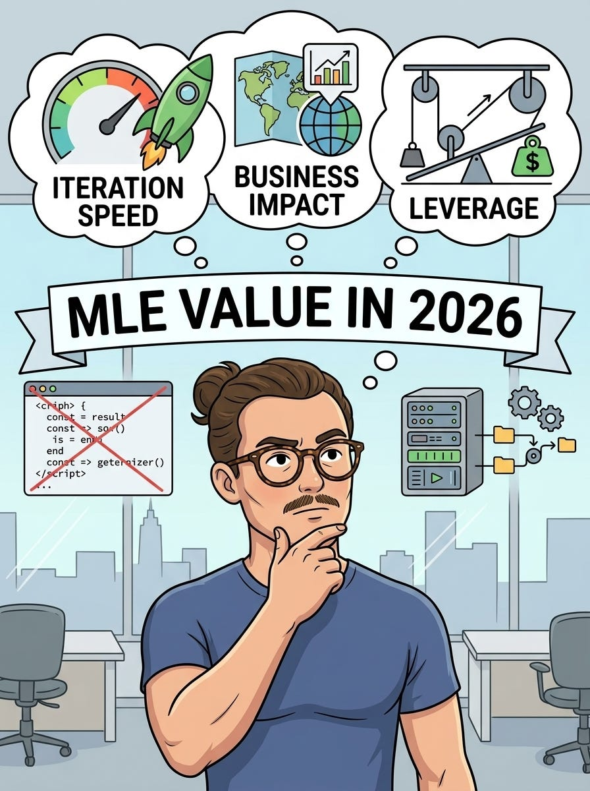

# What’s your value as an MLE in 2026?

*my honest thoughts (as a SWE at FAANG)*

*my honest thoughts (as a SWE at FAANG)*

I have never had this much fun in my job like this year.

is it because of the team I am in?

surely that helps!

however, something else is at play IMHO. I want to discuss that something today! :)

**A few caveats:**

  1. I never cared too much about “the act of writing code”. For me, code has been the thing that gave me the most leverage. (What do you mean I change a line of code and impact O(Billions) of users!?!?!?)

  2. I enjoy a lot driving clearly defined metrics up-and-to-the-right with easiest possible ROI using clever solutions

  3. I love context switching between problems, always having something I am working on to minimize dead times

It’s easy to see why then I love the agentic coding era! :)  
  
the **TLDR** is that I get to run my wild ideas much faster!

but this is a bit too easy to just state as is…! and this made me think: as this accelerates further, where should I focus my time to get the most impact at work?

that’s what I am going to discuss today! :)

Three things I want to focus on:

  * Where is the leverage now?

  * Iteration speed

  * … business impact!

LFG!

# Finding again the leverage

for about a decade the deal was: you learn a painful amount about a system, you earn the right to change one line of it, and that line goes out to a number of people you cannot actually picture. i have never been able to picture a billion of anything. the number just sat there being abstract while i felt great about it.

that deal is quietly getting repriced. the painful part was never the line. it was the eighteen months of learning where to put it, plus the two weeks of plumbing to make it compile in a codebase that has outlived four reorgs.

the plumbing is now nearly free. everyone’s plumbing is nearly free, which is the part people skip. if my afternoon produces what my week used to produce, so does everyone else’s afternoon, and we all converge on the same abundance of diffs and the same scarce supply of reviewers, experiment slots, and launch meetings. the queue doesn’t care how fast you arrived at it.

so what’s left that doesn’t get cheaper. knowing which part of the stack has slack in it. remembering that someone tried this in 2023 and it died for a reason that isn’t written down anywhere. knowing that the feature everyone assumes is live has been silently defaulting to zero since a migration. that stuff is still bought in months of sitting inside one system and paying attention, and no agent is going to hand it to me, because it isn’t in the repo. it’s in people’s heads and in dashboards nobody opens.

# Iteration speed

the funny thing about getting faster is you find out what you were actually waiting for.

i can produce five credible versions of a ranking change in a day now. i cannot evaluate five of anything in a day. offline eval, then the argument about whether offline eval means anything, then the experiment, then waiting for it to stop being noise. that part did not get faster by a single percent. so all the time i saved upstream just walks over and stands in the same line.

which makes the highest-value work i did this year deeply unsexy. making the eval run in minutes. building a cheap proxy metric and then actually checking it correlates with the thing i care about instead of assuming. removing the step where i ping another team and wait a day for data i could have queried myself.

there’s a version of me that spent this year generating beautiful unvalidated ideas at record throughput and felt fantastic. that version is not getting promoted.

the parallel threads only pay off under the same condition. three things in flight is great when each one returns a signal within a few days. at two weeks per signal i’m just paying context-switch tax and rediscovering my own code like a stranger wrote it.

luckily, i ended up launching 17 different things so far this year, so i guess i have a good sense of smell! ;)

# Don’t forget business impact, gotta speed in the right direction ;)

cheap execution makes bad taste more expensive.

when a dumb idea cost three weeks, i’d usually catch myself in week two. sunk cost is a decent smoke alarm. when a dumb idea costs two days, i’ll run ten of them back to back, and every single day will feel productive, and at the end of the quarter i’ll have a folder of neutral experiments and a very nice velocity story that nobody wants to hear in a promo packet.

the incentive gradient here is genuinely bad. shipping volume is visible, legible, easy to talk about in a standup. whether any of it moved a number the business cares about takes a quarter to find out. so the local optimum is to keep producing, and if the whole industry follows that gradient we get a lot of motion and a flat metric, which is roughly the state of every team i’ve watched adopt this badly.

the fix is old and boring and predates all of it. before running the thing, ask what happens if it works. if the honest answer is a 0.2% lift on a metric nobody has looked at since last year, it doesn’t matter that it only costs two days.

i have two days a lot now. that’s the whole problem!

# Closing

Hope you enjoyed this. I do understand there are lots of caveats and there was not much ML in this, but I do think having these guiding lights to be useful :)

Let me know what you think!

— Ludo
