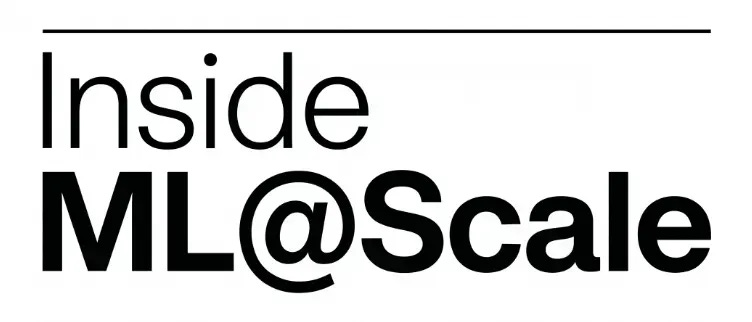
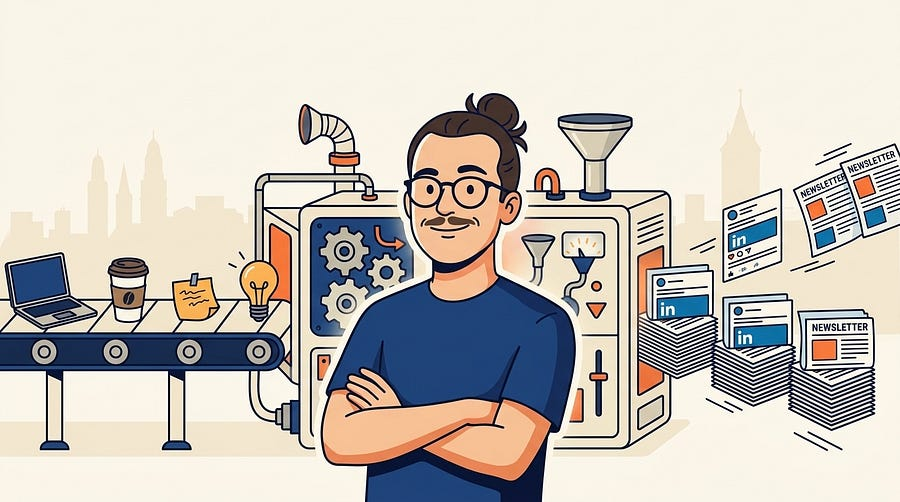

# Inside ML@Scale #6

*Building a side gig on the side*

> Paid post — only the publicly visible preview is included.

*Building a side gig on the side*

Every 25th of the month (well this time is 26th, whops), I publish **Inside ML@Scale**.

A full, honest look at the business behind this newsletter.

Note to self: building a newsletter business is HARD.

But that’s why it’s fun! :)

### **Top-line: where we are in September 2026**

  * **15400+** newsletter subscribers

  * **52,000+** LinkedIn followers

  * **~25%** open rate (still constant, at this point I consider this good lol)

  * **6x/week** LinkedIn/X cadence, **3x/week** newsletter cadence. that’s never going away!

### **What worked this month**

Lots of people loved my take on Code reviews in the Agentic AI Age

## [Code reviews in the Agentic AI age](2026-09-02-code-reviews-in-the-agentic-ai-age.md)

Ludovico Bessi

·

Sep 2

All the below information is my personal opinion that does not reflect the opinion of my company in any shape or form.

[Read full story](2026-09-02-code-reviews-in-the-agentic-ai-age.md)

Also how I keep this up next to a full time job works very well!

## [Six Posts a Week next to a Full-Time Job](2026-09-13-six-posts-a-week-next-to-a-full-time.md)

Ludovico Bessi

·

Sep 13

The second most common question in my DMs. (what’s the first one? Comment below!)

[Read full story](2026-09-13-six-posts-a-week-next-to-a-full-time.md)

Your value as an MLE is also something people liked :)

## [What’s your value as an MLE in 2026?](2026-09-20-whats-your-value-as-an-mle-in-2026.md)

Ludovico Bessi

·

Sep 20

I have never had this much fun in my job like this year.

[Read full story](2026-09-20-whats-your-value-as-an-mle-in-2026.md)

As well as my take on building a promo case :)

## [I stopped building my promo case.](2026-09-23-i-stopped-building-my-promo-case.md)

Ludovico Bessi

·

Sep 23

How will this read?

[Read full story](2026-09-23-i-stopped-building-my-promo-case.md)

I repurposed this post around senior-scope evidence and this time worked quite well. Goes to show how things just need good packaging sometimes!

## [How to manufacture senior-scope evidence before anyone gives you the title](2026-09-09-how-to-manufacture-senior-scope-evidence.md)

Ludovico Bessi

·

Sep 9

Nobody is going to hand you senior scope. So how do you get it?

[Read full story](2026-09-09-how-to-manufacture-senior-scope-evidence.md)

## Something else you’d like to see? More of? Less of? Reply to this email :)

### **What did not work this month**

Surprisingly the Zurich feed did not work so well this month! But that’s the only low light. I take it!

## [THE ZÜRICH FEED [Edition #10]](2026-09-16-the-zurich-feed-edition-10.md)

Ludovico Bessi

·

Sep 16

[![THE ZÜRICH FEED \[Edition #10\]](../assets/e8109aee1a009fbc.webp)](2026-09-16-the-zurich-feed-edition-10.md)

Hey! Welcome to the 10th (!!!, time flies!) edition of The Zürich Feed. 🥂

[Read full story](2026-09-16-the-zurich-feed-edition-10.md)

# **The juicy business numbers**

All right. Let’s get into the details.
