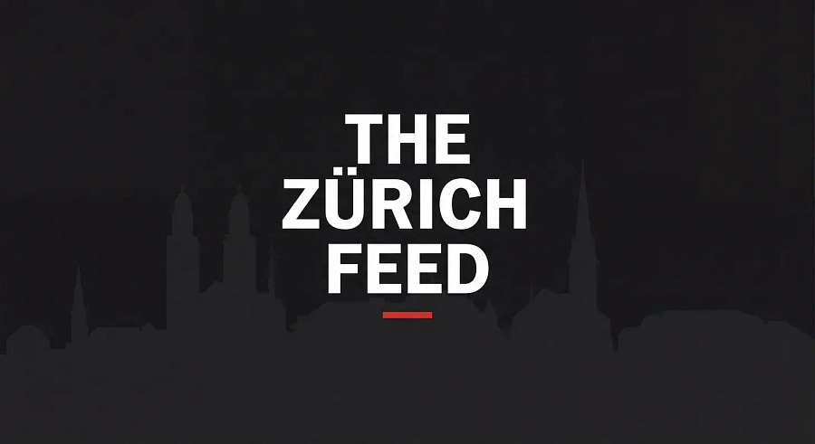

# THE ZÜRICH FEED [Edition #11]

*Curated ML roles in Zürich. With context no job board gives you.*

> Paid post — only the publicly visible preview is included.

*Curated ML roles in Zürich. With context no job board gives you.*

Hey!

Welcome to the 11th edition of The Zürich Feed. 🥂

Every two weeks I manually go through **ML roles** in Zürich, filter out the noise, and add the context that job boards won’t give you. (i.e companies that just opened up offices, up and coming startup you have not yet heard of)

This week: **83** hand picked roles for you :)

**💥💥 Zürich is booming! 💥💥**

**📡 MARKET PULSE**

> Want to come to Zürich? Get good at Robotics or deep ML :)

**👀 ONE THING I’M WATCHING**

> Robotics scaleups are picking up hiring, but so are frontier AI labs :)

The median salary in Zürich is 95k CHF / year. 

Deep tech ML jobs go for much higher, I’d argue x2 at least. Pretty good ROI to get biweekly access to such opportunities if you ask me ;)

All roles below!!
